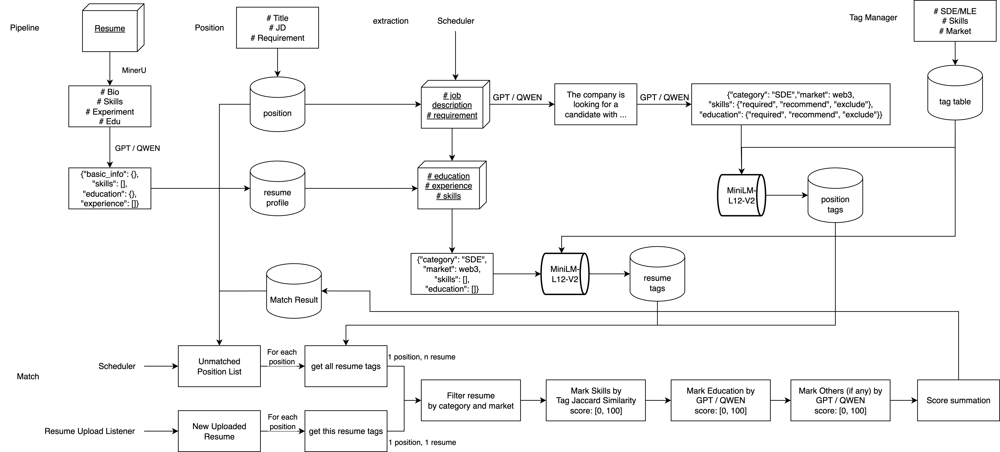

# AI Resume Matcher

An end-to-end resume intelligence stack that ingests raw PDF resumes, extracts structured insights with LLMs, classifies skills against a curated taxonomy, and surfaces searchable results, management tooling, and match analytics through a Next.js admin console backed by Supabase.


## Feature Highlights

- **Automated resume pipeline** – watches drop folders, performs OCR (MinerU with graceful fallback), normalizes resumes into a strict JSON schema, validates tags, and persists results to Supabase with rich status tracking.
- **LLM-aided skill taxonomy** – resume and position tags are constrained to dictionary values, with semantic cleanup driven by Sentence Transformers and background extraction queues for resumes and jobs.
- **Optional candidate-position matcher** – queue-based service can rank resumes for each position using tag overlap and heuristic scoring, writing results back to Supabase for downstream review.
- **Next.js operations console** – upload desk (single/batch with status polling), resume discovery filters, dual-pane resume/position management, and match analytics dashboards powered by HeroUI components.
- **Supabase-first integration** – typed client helpers, REST endpoints, and comprehensive schema docs keep the datastore transparent and reproducible.

## System Architecture


### Resume ingestion pipeline

1. **Upload** – Users drop PDFs/Word docs via the Next.js UI; the API stores them under the pipeline’s `uploads/pending` directory (Windows path by default, adjust per environment).
2. **File watching & queueing** – `watchdog` tracks the pending folder, debounces active writes, and forwards file paths to the processing executor.
3. **Pipeline orchestration** – `ResumeProcessingService` validates environment prerequisites, launches the watcher, background scheduler, extraction worker, and a thread-pooled pipeline processor with health reporting.
4. **OCR & normalization** – MinerU (via conda) converts PDFs to Markdown with PyPDF2 fallback, ensuring text is available even when OCR fails.
5. **LLM structuring & tagging** – GPT-based parser emits resumes conforming to the schema, followed by controlled tag classification and validation against the Supabase dictionary.
6. **Persistence & status updates** – Supabase tables (`files`, `resume`, tag tables) track every stage, with exponential backoff on transient errors.
7. **Post-processing queues** – The extraction worker reprocesses unmatched resumes/positions for enriched tagging, and the optional `MatchService` can schedule candidate-to-position scoring runs.
8. **Observability** – Statistics thread and log files provide at-a-glance metrics, with guidance for common failure modes in the pipeline README.

### Front-end portals

- **Upload console** – Single or batch uploads with inline validation, live toasts, editable metadata, and automatic polling of processing status via `/api/resume-status`.
- **Resume search** – Filter panel supports job category, tag, work years, education level, and university tier with server-side filtering logic over the Supabase-backed resume view.
- **Resume & position management** – Tabbed interface lists paginated resumes and positions, invokes Supabase directly for resumes, and uses `/api/positions` for CRUD (add/edit/delete) plus modals for recommendations.
- **Match intelligence** – Dedicated view aggregates simplified match stats, links into detailed comparisons, and surfaces aggregated counts per resume or position through `/api/simple-matches` and `/api/match-results`.

## Repository Layout

| Path                           | Description                                                  |
| ------------------------------ | ------------------------------------------------------------ |
| `AI_resume_app/ai_resume_app/` | Next.js 15 admin console using HeroUI, Supabase JS client, and matching dashboards. |
| `file_pipeline/`               | Python ingestion pipeline (watchers, OCR, LLM parsing, tagging, scheduling, logging). |
| `data_process/`                | Standalone scripts for bulk MinerU conversion and LLM-based resume JSON generation, useful during backfills. |
| `document/`                    | Database schema and design notes detailing tables, indexes, and triggers for Supabase. |

## Getting Started

### Prerequisites

- Supabase project URL and service/anon keys, OpenAI-compatible API key, and a configured MinerU environment (update the conda env name if different).
- Node.js ecosystem for the Next.js app plus Python environment with the pipeline requirements (add `sentence-transformers` for semantic tag cleanup).

### Front-end setup

```
cd AI_resume_app/ai_resume_app
npm install        # or pnpm/yarn
npm run dev        # starts Next.js
```

Scripts and dependencies are defined in `package.json`.

Create `.env.local` with your Supabase credentials:

```
NEXT_PUBLIC_SUPABASE_URL=...
NEXT_PUBLIC_SUPABASE_ANON_KEY=...
```

The client will throw if these are missing.

### Pipeline setup

```
cd file_pipeline
python -m venv .venv && source .venv/bin/activate
pip install -r requirements.txt
pip install sentence-transformers  # required by tag extraction
```


Copy environment variables into `.env` (create if absent):

```
SUPABASE_URL=...
SUPABASE_KEY=...
OPENAI_API_KEY=...
OPENAI_BASE_URL=https://az.gptplus5.com/v1
LOG_LEVEL=INFO
```

Directories for `uploads/{pending,processing,completed,failed}` and `logs/pipeline.log` are created automatically on startup.

> **Note:** The upload API currently writes to a Windows path under `file_pipeline/uploads/pending`. Update `app/api/upload-resume/route.ts` if you deploy on Linux/macOS.

### Start services

- **Pipeline:** `python main.py` (spawns watcher, processor, extraction worker, scheduler).
- **Next.js app:** `npm run dev` from `AI_resume_app/ai_resume_app`.

Drop PDFs into `file_pipeline/uploads/pending` (or use the UI) and monitor logs/stats for progress.

### Optional match service

If you want automated resume-position scoring, enable the commented `MatchService` wiring in `main.py` and run the queue worker; it writes ranked results to `match_result`.

## Key API Endpoints

| Endpoint                              | Purpose                                                      |
| ------------------------------------- | ------------------------------------------------------------ |
| `POST /api/upload-resume`             | Validates uploads, stores files in the pipeline drop folder with sanitized metadata. |
| `GET /api/resume-status?fileName=...` | Polls Supabase for OCR/LLM status and returns the parsed resume once ready. |
| `GET /api/resume_profiles`            | Filters resumes by job category, tags, experience, education, and university tier before pagination. |
| `GET/POST/PUT/DELETE /api/positions`  | Lists or mutates positions with support for search, status filtering, mandatory keyword logic, and CRUD. |
| `GET/POST /api/simple-matches`        | Aggregates simplified match statistics for dashboards (by position or resume) and fetches detail payloads. |
| `GET /api/match-results`              | Retrieves stored match scores per position (with linked resume profiles). |

## Database Schema & Utilities

- Full Supabase schema (tables, enums, indexes, triggers) lives under `document/database_schema_complete.md` for migrations or external tooling.
- CLI helpers:
    - `data_process/MinerU.py` – batch OCR PDFs to Markdown using local MinerU CLI.
    - `data_process/resume_transform.py` – prompt OpenAI to convert Markdown resumes to schema-compliant JSON, saving timestamped files.
    - `file_pipeline/import_positions.py` & `categorize_positions.py` – ingest Excel job sheets and classify positions with LLM assistance.
    - `file_pipeline/check_database.py` – spot-check recent Supabase records and local file presence for troubleshooting.

## Development & Operations Tips

- Run `npm run lint` inside the Next.js app for ESLint + Prettier checks.
- Tail logs via `tail -f file_pipeline/logs/pipeline.log` for processing diagnostics (log file configured in settings).
- Pipeline stats print every 30 seconds, summarizing totals, success/failure counts, and directory occupancy.
- Troubleshooting guides for MinerU, Supabase, OpenAI, and filesystem permissions are documented in the pipeline README.

With these components in place, you can automate resume ingestion, maintain a normalized talent database, and iterate rapidly on matching heuristics or UI workflows.

